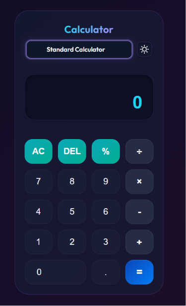
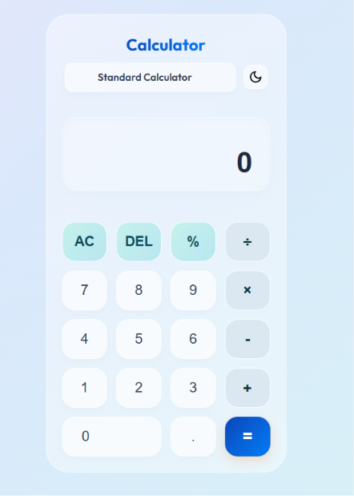
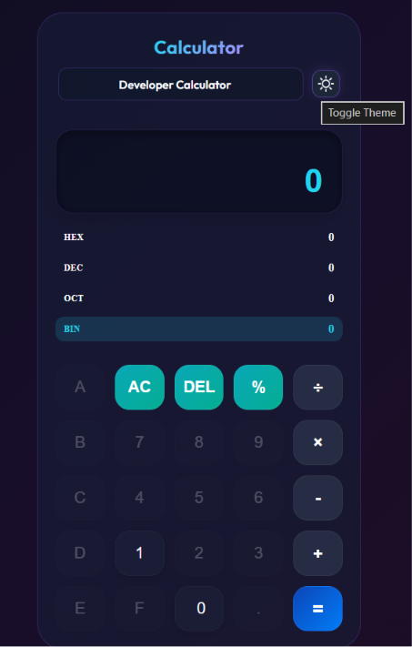
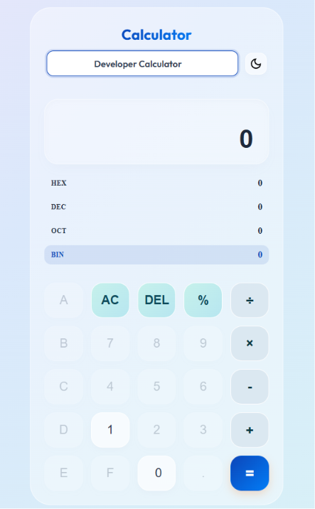

# Calculator

A modern, dual-mode calculator built with **TypeScript** and **Vite** — featuring a Standard mode for everyday arithmetic and a Developer mode for working with multiple number bases (HEX, DEC, OCT, BIN).

## 📸 Screenshots

| Dark Theme                                             | Light Theme                                              |
| ------------------------------------------------------ | -------------------------------------------------------- |
|    |    |
|  |  |

---

---

## Features

### Standard Mode

- Basic arithmetic operations: addition, subtraction, multiplication, division, and mod
- Decimal point support
- Expression history display (shows the previous expression above the result)
- DEL (backspace) and AC (all clear) buttons
- Error handling with visual feedback

### Developer Mode

- Real-time base conversion panel showing the current value in all four bases simultaneously:
  - **HEX** — Hexadecimal (base 16)
  - **DEC** — Decimal (base 10)
  - **OCT** — Octal (base 8)
  - **BIN** — Binary (base 2)
- Switch active base by clicking any row in the panel — the expression on screen converts automatically
- Hexadecimal letter keys (A–F) appear and are enabled only in HEX mode
- Number buttons are automatically restricted based on the active base (e.g., only 0 and 1 are available in BIN mode)
- Decimal point is disabled in Developer mode (integer-only arithmetic)

### Theming

- Light and Dark themes with a toggle button
- Detects the OS/browser color scheme preference automatically on first load
- Theme preference is saved to `localStorage`

### 💾 Persistence

- Both the selected calculator mode and theme are saved to `localStorage`
- Settings are restored automatically when the page is reopened

---

## Project Structure

```
project/
├── docs/              # Images used in the README documentation
    ├── Screenshots/
    |   ├── dark-developer.png
    |   ├── dark-standard.png
    |   ├── light-developer.png
    |   └── light-standard.png
├── public/              # Static assets
├── src/
│   ├── style/
│   │   ├── dark.css     # Dark theme styles
│   │   ├── light.css    # Light theme styles
│   │   └── style.css    # Shared base styles (layout, buttons, programmer panel, animations)
│   └── main.ts          # All app logic: HTML injection, event listeners, calculator functions
├── .gitignore
├── index.html           # App entry point
├── package-lock.json
├── package.json
├── README.md
└── tsconfig.json
```

---

## Getting Started

### Prerequisites

- [Node.js](https://nodejs.org/) v16 or higher
- npm

### Installation

```bash
# Clone the repository
git clone https://github.com/EmranAbdeen/Calculator.git
cd Calculator

# Install dependencies
npm install

# Start the development server
npm run dev
```

### Build for Production

```bash
npm run build
```

The output will be in the `dist/` folder, ready to be deployed.

---

## How It Works

### Architecture

The entire app is written in a single TypeScript file (`main.ts`). The HTML is injected dynamically into the `#app` div at runtime.

A global click listener on `document` routes button presses to the appropriate handler:

```
click event
    ↓
clearError()
    ↓
AC → AllClear()
DEL → deleteElement()
.   → decimalDot()
=   → equals()
default → operation()
```

Number buttons and HEX letter buttons (A–F) have their own dedicated event listeners registered via `querySelectorAll`.

### Developer Mode — Base Conversion

The base conversion system works in three layers:

| Function                                  | Purpose                                                                                            |
| ----------------------------------------- | -------------------------------------------------------------------------------------------------- |
| `parseToDecimal(value, base)`             | Converts a string number in any base to a JS decimal integer                                       |
| `formatFromDecimal(value, base)`          | Converts a decimal integer to a string in any base                                                 |
| `convertExpressionBase(expr, from, to)`   | Converts every number token in an expression string from one base to another, preserving operators |
| `evaluateExpressionToDecimal(expr, base)` | Evaluates a full expression written in a given base and returns the decimal result                 |
| `updateBasePanel()`                       | Evaluates the current display value and updates all four base rows in the panel                    |

**Switching bases** — when you click a base row, the current expression on screen is converted token-by-token to the new base using `convertExpressionBase()`, so the expression remains valid in the new base.

**Button restriction** — `updateKeyboardRestriction()` enables/disables number and letter buttons depending on the active base, preventing invalid input at the UI level.

### Theme System

Themes are applied by setting `document.body.className` to either `light-theme` or `dark-theme`. All component styles in `light.css` and `dark.css` are scoped under these class selectors, so switching the body class instantly applies the correct theme.

---

## CSS Architecture

Styles are split across three files:

- **`style.css`** — Theme-agnostic base styles: layout, button resets, programmer panel animation (`max-height` transition), base row grid, and the grid switching logic between Standard (4 columns) and Developer (5 columns) modes.
- **`light.css`** — All component styles scoped under `.light-theme`.
- **`dark.css`** — All component styles scoped under `.dark-theme`.

The developer panel reveal uses a smooth CSS transition on `max-height`:

```css
.programmer-panel {
  max-height: 0;
  overflow: hidden;
  transition: all 0.3s ease;
}

.cal.mode-developer .programmer-panel {
  max-height: 180px;
}
```

---

## Tech Stack

| Technology            | Role                              |
| --------------------- | --------------------------------- |
| TypeScript            | Application logic and type safety |
| Vite                  | Development server and bundler    |
| CSS (vanilla)         | Styling with theme scoping        |
| Google Fonts (Outfit) | Typography                        |
| localStorage          | theme and mode preferences        |

---

## 📋 Known Limitations

- Developer mode arithmetic works on **integers only** — fractional results are floored.
- Expression evaluation uses JavaScript's `eval()` under the hood. Inputs are pre-validated and sanitized, but the calculator is intended for local/personal use.
- Very large binary or hexadecimal values may exceed JavaScript's safe integer range (`Number.MAX_SAFE_INTEGER`).
